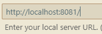

# Montando o app mobile
_Parte 1 - Configurações_

### Stacks usadas
1. NodeJs || 2. React Native || 3. Expo

## 1. Instalar o nodejs
_Instale o chocolatey >> instale o nvm-windows >> instale o nodejs_

1. Chocolatey [Executar como Administrador no powershell]
```
Set-ExecutionPolicy Bypass -Scope Process -Force; [System.Net.ServicePointManager]::SecurityProtocol = [System.Net.ServicePointManager]::SecurityProtocol -bor 3072; iex ((New-Object System.Net.WebClient).DownloadString('https://community.chocolatey.org/install.ps1'))
```
2. NVM-windows [Documentação nvm-windows](https://github.com/coreybutler/nvm-windows/releases)

3. Instalar o Node pelo nvm-windows

```
  nvm list available                      // lista versões disponíveis
  nvm install numero-versão               // instala uma versão do node
  nvm ls                                  // vista versões do node instaladas na máquina
  nvm use numero-versão                   //seleciona a versão do node
```

## 2. Checar o ambiente de desenvolvimento

1. NodeJs e gerenciador de pacotes
```
node -v
npm -v           //package manager npm
yarn -v         // package manager Yarn
```

2. Expo

_remover o expo cli global para utilizar o local_
```
npm uninstall -g expo-cli
```


## 3. Criar o projeto

```
npx create-expo-app nome-projeto --template //escolhe o tipo de projeto
cd node-projeto
code . //Abrir vscode
```


## 4. Executar o projeto
__Sugiro fazer no terminal do vscode__

```
npx expo start
```


_Para executar na web, é preciso instalar o react-dom_

```
npx expo install react-native-web react-dom @expo/metro-runtime
```


_Use a extensão do vscode **Mobile view** para visualizar em mobile pelo localhost_




### Executar o projeto pelo Expo Go
_Pode ser que haja problemas na comunicação. Nesse caso, fazer a conexão por tunnel_

```
npx expo start --tunnel
```
___
