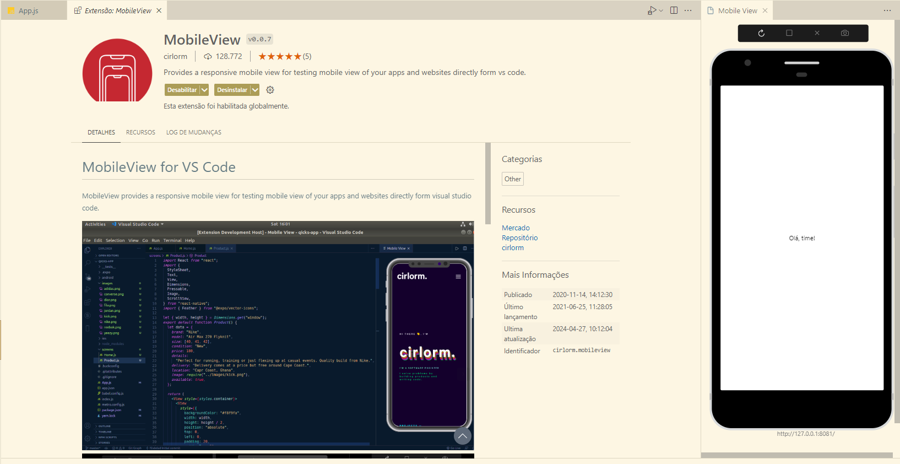

## Navegação
O sistema de navegação preferencialmente precisa ser definido desde o começo. 


### Estratégias de navegação do projeto
- Stack
- Tabs

### Instalar o React navigation

1. Instalar o core de navegação
```
npm install @react-navigation/native
```

2. Instalar as dependências  
```
npx expo install react-native-screens react-native-safe-area-context
```


### Navegação e Telas

### Encapsular o app na navegação
_Feito com o componente    `<NavigationContainer>`_
1. Importar módulos em  app.tsx

```
import { NavigationContainer } from '@react-navigation/native';
```

**Atenção**
Para previnir acessos indevidos, pode-se juntar as telas em diferentes Stacks

AuthStack >>> pilha de autenticação
Telas >> Splash, Cadastro, Login


3. Instalar a estratégia de navegação
_ver documentação oficial_!! [React Navigation](https://reactnavigation.org/)

__Cada estratégia de navegação terá sua própria instalação__
```
npm install @react-navigation/native
```




## Pastas


___
